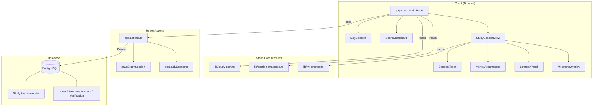

# Design Document: ACT Prep Sessions

## Overview

This design transforms the existing golf tracker Next.js application into an ACT prep study session tool. The app retains its authentication layer (better-auth with User, Session, Account, Verification models), UI primitives (shadcn/ui, Tailwind CSS 4, dark mode), and infrastructure (Prisma 7 + PostgreSQL, React Query, Next.js 16 App Router).

All golf-specific models, components, and server actions are replaced with ACT prep equivalents. The core experience centers on a 41-day study plan (May 3 – June 12, 2026) where Lexie selects a day, starts a timed session with a dollar accumulator showing scholarship earnings, references section strategies, and saves completed sessions. Progress milestones are celebrated with FAU owl-themed overlays.

### Key Design Decisions

1. **Static data over database lookups**: The 41-day study plan and section strategies are compile-time constants — no database queries needed to render the plan or strategies. This keeps the app fast and simple.
2. **Single-page app with modal/panel session view**: Rather than routing to a separate page for study sessions, the session view replaces the day selector in-place on the main page. This avoids route complexity and keeps React state (timer, accumulator) alive without hydration concerns.
3. **Upsert-based session persistence**: Each day allows exactly one StudySession record per user (unique constraint on `dayNumber + userId`). Completing a day again updates the existing record rather than creating duplicates.
4. **Client-side timer with server-side persistence**: The countdown timer and money accumulator run entirely in the browser via `setInterval`. Only the final elapsed time is persisted to the database on session completion. This avoids unnecessary server round-trips during active study.
5. **FAU theming via CSS custom properties**: FAU brand colors (red `#CC0000`, blue `#003366`) are defined as CSS variables and used in milestone overlays and progress indicators, keeping them consistent and easy to adjust.

## Architecture

The application follows the existing Next.js 16 App Router architecture with server actions for data mutations.



### Data Flow

1. **Page load**: `page.tsx` calls `getStudySessions()` server action to fetch completed sessions, then renders `DaySelector` and `ScoreDashboard` with static plan data + session records.
2. **Day selection**: User clicks a day → app state switches to session view, passing the `StudyPlanDay` and any existing `StudySession` to `StudySessionView`.
3. **Active session**: `SessionTimer` counts down from the day's allocated minutes. `MoneyAccumulator` derives its value from elapsed seconds. `StrategyPanel` displays section-specific content from static data.
4. **Session completion**: User clicks "Complete" → `saveStudySession()` server action upserts the record → UI shows confirmation → milestone check triggers overlay if threshold crossed → state returns to day selector with updated completion status.

## Components and Interfaces

### Static Data Modules

#### `lib/study-plan.ts`

```typescript
export interface StudyPlanDay {
  dayNumber: number;        // 1–41
  date: string;             // "May 3" format for display
  isoDate: string;          // "2026-05-03" for date comparison
  phase: number;            // 0–3
  phaseName: string;        // "Setup" | "Foundations" | "Strategy + Timed Practice" | "Full Practice Tests + Final Sharpening"
  section: "English" | "Math" | "Reading" | "All" | "Setup" | "Rest";
  topic: string;            // e.g., "Comma rules"
  resource: string;         // e.g., "Khan Academy Grammar → Commas"
  timeMinutes: number;      // allocated study time
}

export const STUDY_PLAN: readonly StudyPlanDay[] = [ /* 41 entries */ ];

export function getStudyPlanDay(dayNumber: number): StudyPlanDay | undefined;
```

#### `lib/section-strategies.ts`

```typescript
export interface StrategyRule {
  title: string;
  content: string;         // markdown-formatted text
  examples?: string[];     // example sentences or formulas
}

export interface SectionStrategy {
  section: "English" | "Math" | "Reading";
  overview: string;
  rules: StrategyRule[];
  tips: string[];
  resources: { name: string; url?: string }[];
}

export const SECTION_STRATEGIES: readonly SectionStrategy[] = [ /* 3 entries */ ];

export function getStrategyForSection(section: string): SectionStrategy | undefined;
```

#### `lib/milestones.ts`

```typescript
export interface OwlMilestone {
  threshold: number;        // cumulative completed days
  name: string;             // e.g., "Owlet"
  title: string;            // e.g., "You're hatching!"
  message: string;          // motivational message referencing FAU
  emoji: string;            // "🥚" | "🐣" | "🦉" etc.
}

export const OWL_MILESTONES: readonly OwlMilestone[] = [
  { threshold: 5,  name: "Owlet",       title: "You're hatching!",       message: "Five days in. The nest is getting warm. 🌴", emoji: "🐣" },
  { threshold: 10, name: "Fledgling",   title: "Spreading your wings",   message: "You just earned your wings. Boca Raton is calling 🌴", emoji: "🐥" },
  { threshold: 20, name: "Soaring Owl", title: "Halfway to Boca",        message: "20 days of flight. FAU can see you coming. 🦉", emoji: "🦅" },
  { threshold: 30, name: "Wise Owl",    title: "Almost there",           message: "Wisdom earned. 11 days to go. Owlsley is proud. 🎓", emoji: "🦉" },
  { threshold: 41, name: "Full Owl",    title: "FAU bound!",             message: "You did it. 41 days. See you at FAU. 🦉🎓", emoji: "🦉🎓" },
];

export function getCurrentMilestone(completedDays: number): OwlMilestone | undefined;
export function getNextMilestone(completedDays: number): OwlMilestone | undefined;
export function checkMilestoneCrossed(previousCount: number, newCount: number): OwlMilestone | undefined;
```

### React Components

#### `components/day-selector.tsx`

Displays all 41 study plan days grouped by phase, with completion indicators.

```typescript
interface DaySelectorProps {
  studyPlan: readonly StudyPlanDay[];
  completedDays: Set<number>;       // set of completed day numbers
  onSelectDay: (day: StudyPlanDay) => void;
}
```

- Groups days by `phase` with phase headers
- Each day card shows: date, section badge (color-coded), topic
- Completed days show a check icon overlay
- Current calendar day is highlighted with a distinct border/glow
- Progress summary bar at top: "X / 41 days completed"
- Responsive: single column on mobile, 2–3 columns on desktop

#### `components/score-dashboard.tsx`

Displays current scores, targets, scholarship info, and test countdown.

```typescript
interface ScoreDashboardProps {
  completedDays: number;
  currentMilestone: OwlMilestone | undefined;
  nextMilestone: OwlMilestone | undefined;
}
```

- Static score data (current: E19/M18/R25/C21, target: E24/M24/R27/C25)
- Scholarship goal: "Florida Medallion Scholars (FMS) Bright Futures — ~$18,000–$20,000+ over 4 years"
- Test date countdown: days remaining until June 13, 2026
- Current owl milestone rank + progress bar toward next milestone
- Uses FAU accent colors for progress indicators

#### `components/study-session-view.tsx`

The main session container that orchestrates timer, accumulator, strategy panel, and completion.

```typescript
interface StudySessionViewProps {
  day: StudyPlanDay;
  existingSession: StudySessionRecord | null;
  onComplete: (session: StudySessionRecord) => void;
  onBack: () => void;
}
```

- If `existingSession` exists, shows previous elapsed time and notes with option to start new session
- Contains `SessionTimer`, `MoneyAccumulator`, `StrategyPanel`
- Notes textarea for session notes
- "Complete Session" button triggers save

#### `components/session-timer.tsx`

Countdown timer with start/pause/resume and overtime tracking.

```typescript
interface SessionTimerProps {
  allocatedMinutes: number;
  isRunning: boolean;
  onStart: () => void;
  onPause: () => void;
  onResume: () => void;
  elapsedSeconds: number;
}
```

- Displays remaining time in MM:SS format during countdown
- When countdown reaches zero, switches to overtime display (continues counting up)
- Visual indication when allocated time is complete (color change, "Overtime!" label)
- Start/Pause/Resume button toggles based on state

#### `components/money-accumulator.tsx`

Displays running scholarship dollar amount based on elapsed study time.

```typescript
interface MoneyAccumulatorProps {
  elapsedSeconds: number;
  isRunning: boolean;
}
```

- Calculates: `elapsedSeconds * (633 / 3600)` = dollars earned
- Formats as `$X.XX` with dollar sign and two decimal places
- Updates every second while timer is running
- Shows hourly rate context: "$633/hr"
- Animated number transition for visual appeal

#### `components/strategy-panel.tsx`

Displays section-specific strategies and resources for the current day.

```typescript
interface StrategyPanelProps {
  day: StudyPlanDay;
  strategy: SectionStrategy;
}
```

- Shows day's topic and resource at the top
- Renders section rules, tips, and resource links
- Independently scrollable from the timer area (sticky timer header on mobile)
- Collapsible sections for rules to avoid overwhelming the view

#### `components/milestone-overlay.tsx`

Celebratory overlay when a milestone threshold is crossed.

```typescript
interface MilestoneOverlayProps {
  milestone: OwlMilestone;
  onDismiss: () => void;
}
```

- Full-screen overlay with FAU brand colors (red `#CC0000`, blue `#003366`)
- Displays milestone name, emoji, and motivational message
- Auto-dismisses after 5 seconds via `setTimeout`
- Dismissible on click/tap
- Special "Full Owl" variant for day 41 completion with enhanced celebration

### Server Actions

#### `app/actions.ts`

```typescript
// Replaces saveRangeSession, saveRound, getClubAverages

export async function saveStudySession(data: {
  dayNumber: number;
  section: string;
  topic: string;
  elapsedSeconds: number;
  notes?: string;
}): Promise<{ ok: true }>;

export async function getStudySessions(): Promise<StudySessionRecord[]>;
```

- `saveStudySession`: Authenticates via `auth.api.getSession()`, upserts `StudySession` keyed by `dayNumber + userId`. Sets `startTime` on create, always updates `endTime` to now and `elapsedSeconds` to the provided value. Throws on unauthenticated.
- `getStudySessions`: Returns all `StudySession` records for the authenticated user. Returns empty array if unauthenticated.

## Data Models

### Prisma Schema Changes

**Remove**: `RangeSession`, `RangeShot`, `Round`, `Hole` models and their relations on `User`.

**Add**: `StudySession` model with relation to `User`.

**Retain**: `User`, `Session`, `Account`, `Verification` (better-auth models) unchanged.

```prisma
model StudySession {
  id             Int      @id @default(autoincrement())
  dayNumber      Int                          // 1–41
  section        String                       // "English" | "Math" | "Reading" | "All" | "Setup" | "Rest"
  topic          String                       // from study plan
  startTime      DateTime @default(now())
  endTime        DateTime?
  elapsedSeconds Int      @default(0)
  notes          String?
  userId         String
  user           User     @relation(fields: [userId], references: [id], onDelete: Cascade)

  @@unique([dayNumber, userId])
  @@map("study_session")
}
```

**User model update** — replace golf relations:

```prisma
model User {
  // ... existing better-auth fields unchanged ...
  studySessions StudySession[]
  // Remove: rangeSessions, rounds
}
```

### TypeScript Types (derived from Prisma)

```typescript
// Returned by getStudySessions, used in client components
export interface StudySessionRecord {
  id: number;
  dayNumber: number;
  section: string;
  topic: string;
  startTime: Date;
  endTime: Date | null;
  elapsedSeconds: number;
  notes: string | null;
}
```


## Correctness Properties

*A property is a characteristic or behavior that should hold true across all valid executions of a system — essentially, a formal statement about what the system should do. Properties serve as the bridge between human-readable specifications and machine-verifiable correctness guarantees.*

### Property 1: Study plan data validity

*For any* entry in the STUDY_PLAN array, the entry SHALL have a dayNumber between 1 and 41 (inclusive), a non-empty date string, a valid isoDate matching YYYY-MM-DD format, a phase between 0 and 3, a non-empty phaseName, a section that is one of "English" | "Math" | "Reading" | "All" | "Setup" | "Rest", a non-empty topic, a non-empty resource, and a timeMinutes that is a positive number. The array SHALL contain exactly 41 entries with unique dayNumbers.

**Validates: Requirements 2.1**

### Property 2: Study plan lookup round-trip

*For any* integer dayNumber in the range 1–41, calling `getStudyPlanDay(dayNumber)` SHALL return a `StudyPlanDay` object whose `dayNumber` field equals the input. *For any* integer outside the range 1–41, calling `getStudyPlanDay(dayNumber)` SHALL return `undefined`.

**Validates: Requirements 2.3**

### Property 3: Time formatting correctness

*For any* non-negative integer of seconds, the time formatting function SHALL produce a string in MM:SS format where the minutes component equals `Math.floor(seconds / 60)` (zero-padded to at least 2 digits) and the seconds component equals `seconds % 60` (zero-padded to exactly 2 digits).

**Validates: Requirements 5.6**

### Property 4: Earnings calculation correctness

*For any* non-negative number of elapsed seconds, the earnings calculation function SHALL return a value equal to `elapsedSeconds * (633 / 3600)`. This implies monotonicity: for any t1 < t2, `calculateEarnings(t1) < calculateEarnings(t2)`, and `calculateEarnings(0) === 0`.

**Validates: Requirements 6.1, 6.2**

### Property 5: Dollar formatting correctness

*For any* non-negative number, the dollar formatting function SHALL produce a string matching the pattern `$X.XX` — a dollar sign followed by one or more digits, a decimal point, and exactly two decimal digits. The numeric value represented by the formatted string SHALL be within rounding tolerance (±0.005) of the input.

**Validates: Requirements 6.4**

### Property 6: Upsert idempotency

*For any* valid dayNumber (1–41) and userId, calling `saveStudySession` N times (N ≥ 1) with the same dayNumber and userId SHALL result in exactly one StudySession record in the database for that dayNumber+userId combination. The record's elapsedSeconds and notes SHALL match the most recent call's values.

**Validates: Requirements 8.5, 11.1**

### Property 7: Test countdown correctness

*For any* date before June 13, 2026, the test countdown function SHALL return a positive integer representing the number of days remaining. *For any* date on or after June 13, 2026, the function SHALL return 0.

**Validates: Requirements 9.4**

### Property 8: Milestone crossing detection

*For any* previousCount and newCount where 0 ≤ previousCount < newCount ≤ 41, `checkMilestoneCrossed(previousCount, newCount)` SHALL return a milestone if and only if there exists at least one milestone threshold T in {5, 10, 20, 30, 41} such that previousCount < T ≤ newCount. When multiple thresholds are crossed, it SHALL return the highest one crossed.

**Validates: Requirements 12.2**

### Property 9: Milestone rank lookup

*For any* completedDays count in the range 0–41, `getCurrentMilestone(completedDays)` SHALL return the milestone with the highest threshold that is ≤ completedDays, or undefined if completedDays < 5. `getNextMilestone(completedDays)` SHALL return the milestone with the lowest threshold that is > completedDays, or undefined if completedDays ≥ 41.

**Validates: Requirements 12.4**

## Error Handling

### Server Action Errors

| Error Scenario | Handling |
|---|---|
| Unauthenticated `saveStudySession` call | Throw `Error("Unauthorized")` — client catches and redirects to sign-in |
| Unauthenticated `getStudySessions` call | Return empty array `[]` — no error thrown, graceful degradation |
| Invalid dayNumber (outside 1–41) | Validate on client before calling action; server action validates and throws `Error("Invalid day number")` |
| Database connection failure | Prisma throws; server action propagates error; client shows generic "Save failed" message with retry option |
| Concurrent upsert race condition | PostgreSQL unique constraint + Prisma upsert handles this atomically — no application-level handling needed |

### Client-Side Errors

| Error Scenario | Handling |
|---|---|
| Timer state corruption (e.g., negative elapsed) | Clamp elapsed seconds to `Math.max(0, elapsed)` in timer logic |
| Session save failure | Show error toast with "Save failed — try again" message; preserve timer state so no data is lost |
| Network offline during save | React Query mutation retry (if configured) or manual retry button; timer state preserved in component state |
| Study plan day not found | Show "Day not found" message and return to day selector — should never happen with static data |
| Strategy not found for section | Fall back to showing the day's topic and resource without strategy details |

### Data Validation

- `dayNumber`: Validated as integer 1–41 on both client (before calling action) and server (in action)
- `elapsedSeconds`: Validated as non-negative integer on server
- `section` and `topic`: Passed from static data, not user-editable — no validation needed
- `notes`: Optional string, no length limit enforced (PostgreSQL TEXT type)

## Testing Strategy

### Unit Tests (Example-Based)

Unit tests cover specific scenarios, edge cases, and UI rendering:

- **Static data structure**: Verify STUDY_PLAN has 41 entries, SECTION_STRATEGIES has 3 entries, OWL_MILESTONES has 5 entries with correct thresholds
- **Strategy lookup**: Verify `getStrategyForSection("English")` returns English strategies, invalid sections return undefined
- **Timer display states**: Verify initial state, countdown, paused, overtime visual indicators
- **Money accumulator display**: Verify "$633/hr" context text is shown, amount updates
- **Milestone overlay**: Verify FAU colors (#CC0000, #003366), auto-dismiss after 5 seconds, dismissible on click
- **Score dashboard**: Verify all static score values, scholarship description, test date
- **Day selector**: Verify phase grouping, completion indicators, current day highlighting
- **Session view with existing session**: Verify previous elapsed time and notes displayed
- **Auth guards**: Verify unauthenticated save throws, unauthenticated get returns empty
- **Accessibility**: Verify keyboard navigation, ARIA labels on interactive elements

### Property-Based Tests

Property-based tests use [fast-check](https://github.com/dubzzz/fast-check) to verify universal properties across generated inputs. Each test runs a minimum of 100 iterations.

| Property | Test Description | Tag |
|---|---|---|
| Property 1 | Generate index into STUDY_PLAN, verify all fields valid | `Feature: act-prep-sessions, Property 1: Study plan data validity` |
| Property 2 | Generate integers 1–41 and outside range, verify lookup | `Feature: act-prep-sessions, Property 2: Study plan lookup round-trip` |
| Property 3 | Generate non-negative integers, verify MM:SS format | `Feature: act-prep-sessions, Property 3: Time formatting correctness` |
| Property 4 | Generate non-negative numbers, verify earnings = seconds × 633/3600 | `Feature: act-prep-sessions, Property 4: Earnings calculation correctness` |
| Property 5 | Generate non-negative numbers, verify $X.XX format and value | `Feature: act-prep-sessions, Property 5: Dollar formatting correctness` |
| Property 6 | Generate dayNumber + multiple save calls, verify single record | `Feature: act-prep-sessions, Property 6: Upsert idempotency` |
| Property 7 | Generate dates before/on/after June 13 2026, verify countdown | `Feature: act-prep-sessions, Property 7: Test countdown correctness` |
| Property 8 | Generate previousCount/newCount pairs, verify crossing detection | `Feature: act-prep-sessions, Property 8: Milestone crossing detection` |
| Property 9 | Generate completedDays 0–41, verify current/next milestone | `Feature: act-prep-sessions, Property 9: Milestone rank lookup` |

### Integration Tests

- **Server action round-trip**: Save a session via `saveStudySession`, retrieve via `getStudySessions`, verify data matches
- **Upsert behavior**: Save twice for the same day, verify only one record exists with latest data
- **Cascade delete**: Create user with sessions, delete user, verify sessions are gone
- **Auth flow**: Verify unauthenticated users are redirected to `/sign-in`

### Test Configuration

- **Framework**: Vitest (add as dev dependency — aligns with Next.js ecosystem)
- **PBT Library**: fast-check (add as dev dependency)
- **Component Testing**: @testing-library/react for UI component tests
- **Minimum PBT iterations**: 100 per property test
- **Property test tagging**: Each test includes a comment with `Feature: act-prep-sessions, Property N: {title}`
