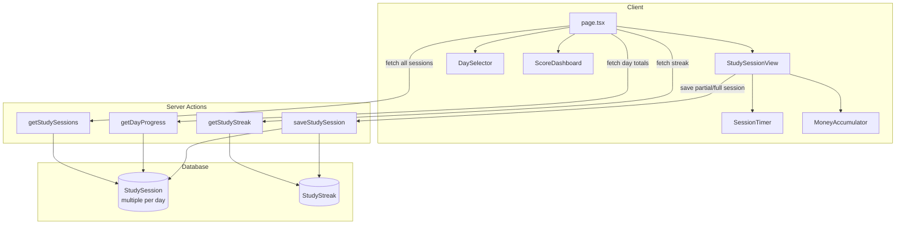
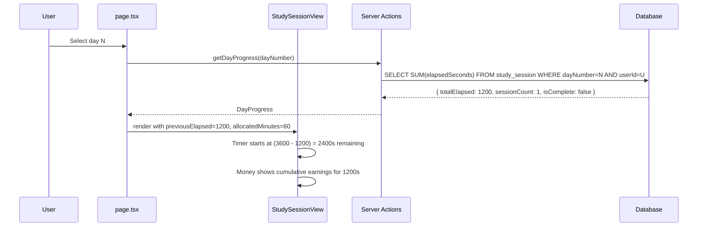
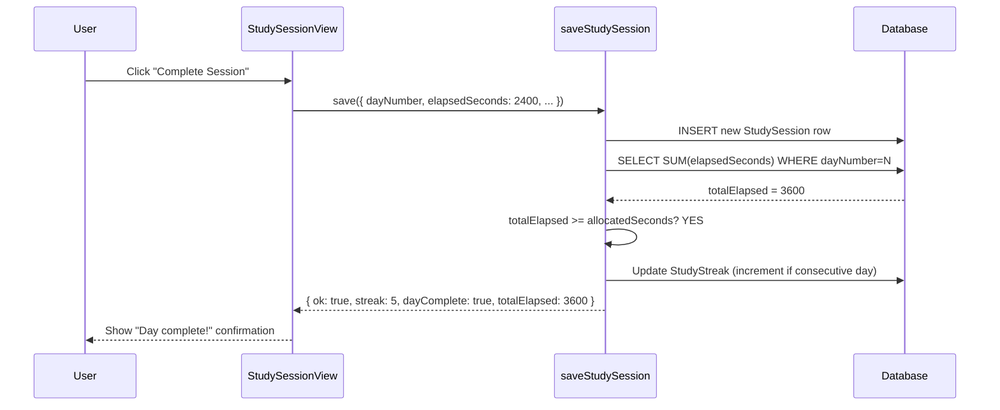
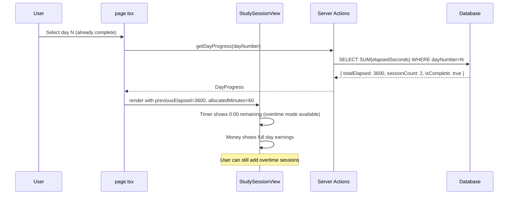

# Design Document: Cumulative Study Sessions

## Overview

The current ACT prep app uses an upsert model for study sessions — one record per day per user, where completing a new session overwrites the previous one. The timer always starts from the full allocated time, money earnings reset to $0, and the streak increments on any save regardless of whether the allocated time was met.

This feature changes the session model to be cumulative. Multiple sessions per day stack together: elapsed time sums across sessions, the timer counts down from the remaining time after prior sessions, money earnings reflect the day's total, and the streak only advances once the full allocated time for the day has been completed across one or more sessions.

The core database change removes the `@@unique([dayNumber, userId])` constraint, allowing multiple rows per day. A new `getDayProgress` query aggregates all sessions for a given day to compute total elapsed time and earnings. The streak logic shifts from "any save = streak increment" to "total elapsed ≥ allocated time = day complete = streak eligible."

## Architecture



## Sequence Diagrams

### Starting a Session (with prior sessions that day)



### Completing a Session (day becomes complete)



### Starting a Session (day already complete)



## Components and Interfaces

### Component 1: StudySessionView (modified)

**Purpose**: Manages the session lifecycle. Now receives cumulative day progress and passes prior elapsed time to child components.

**Interface changes**:
```typescript
interface StudySessionViewProps {
  day: StudyPlanDay;
  dayProgress: DayProgress | null;       // NEW: replaces existingSession
  onComplete: (result: SessionSaveResult) => void;
  onBack: () => void;
  completedDayCount: number;
}
```

**Responsibilities**:
- Initialize timer with remaining time (allocated - previousElapsed)
- Initialize money display with prior earnings
- Save new session rows (not upsert)
- Show cumulative progress for the day

### Component 2: SessionTimer (modified)

**Purpose**: Countdown timer. Now starts from remaining time instead of full allocated time.

**Interface changes**:
```typescript
interface SessionTimerProps {
  allocatedMinutes: number;
  previousElapsedSeconds: number;        // NEW: time already completed today
  isRunning: boolean;
  onStart: () => void;
  onPause: () => void;
  onResume: () => void;
  elapsedSeconds: number;                // current session only
}
```

**Responsibilities**:
- Display remaining = (allocated × 60) - previousElapsed - currentElapsed
- Enter overtime mode when remaining ≤ 0
- Show "X min already completed today" context when previousElapsed > 0

### Component 3: MoneyAccumulator (modified)

**Purpose**: Shows scholarship earnings. Now displays cumulative daily total.

**Interface changes**:
```typescript
interface MoneyAccumulatorProps {
  elapsedSeconds: number;                // current session elapsed
  previousElapsedSeconds: number;        // NEW: prior sessions today
  isRunning: boolean;
}
```

**Responsibilities**:
- Calculate earnings from (previousElapsed + currentElapsed)
- Display total daily earnings, not just current session

### Component 4: page.tsx (modified)

**Purpose**: Top-level page. Changes from storing one session per day to storing aggregated day progress.

**Key changes**:
- `completedSessions` map stores `DayProgress` instead of `StudySessionRecord`
- Fetch `getDayProgress` for selected day before rendering StudySessionView
- A day is "completed" when `totalElapsed >= allocatedSeconds`

## Data Models

### StudySession (Prisma — modified)

```prisma
model StudySession {
  id             Int       @id @default(autoincrement())
  dayNumber      Int
  section        String
  topic          String
  startTime      DateTime  @default(now())
  endTime        DateTime?
  elapsedSeconds Int       @default(0)
  notes          String?
  userId         String
  user           User      @relation(fields: [userId], references: [id], onDelete: Cascade)

  // REMOVED: @@unique([dayNumber, userId])
  // ADD: index for efficient queries
  @@index([dayNumber, userId])
  @@map("study_session")
}
```

**Migration**: Remove the unique constraint, add a composite index. Existing data is preserved — each existing row becomes the first session for that day.

### DayProgress (new TypeScript type)

```typescript
interface DayProgress {
  dayNumber: number;
  totalElapsedSeconds: number;
  sessionCount: number;
  isComplete: boolean;           // totalElapsed >= allocatedSeconds
  latestNotes: string | null;    // notes from most recent session
  latestEndTime: Date | null;    // end time of most recent session
}
```

**Validation Rules**:
- `totalElapsedSeconds` ≥ 0
- `sessionCount` ≥ 0
- `isComplete` is derived: `totalElapsedSeconds >= allocatedMinutes * 60`
- When `sessionCount` is 0, `totalElapsedSeconds` must be 0

### SessionSaveResult (new TypeScript type)

```typescript
interface SessionSaveResult {
  ok: true;
  streak: number;
  dayComplete: boolean;
  totalElapsedSeconds: number;
  sessionCount: number;
}
```

### StudyStreak (unchanged schema, changed logic)

The `StudyStreak` model schema stays the same. The behavioral change is in when the streak updates:
- **Before**: Any `saveStudySession` call updates the streak
- **After**: Streak only updates when `totalElapsedSeconds >= allocatedSeconds` for the day

## Algorithmic Pseudocode

### Algorithm 1: saveStudySession (revised)

```typescript
async function saveStudySession(data: {
  dayNumber: number;
  section: string;
  topic: string;
  elapsedSeconds: number;
  allocatedMinutes: number;
  notes?: string;
}): Promise<SessionSaveResult> {
  // ASSERT: user is authenticated
  // ASSERT: dayNumber in [1..41]
  // ASSERT: elapsedSeconds >= 0
  // ASSERT: allocatedMinutes >= 0

  // Step 1: INSERT new session row (not upsert)
  await prisma.studySession.create({
    data: {
      dayNumber: data.dayNumber,
      section: data.section,
      topic: data.topic,
      elapsedSeconds: data.elapsedSeconds,
      notes: data.notes ?? null,
      endTime: new Date(),
      userId: userId,
    },
  });

  // Step 2: Aggregate total elapsed for this day
  const aggregate = await prisma.studySession.aggregate({
    where: { dayNumber: data.dayNumber, userId: userId },
    _sum: { elapsedSeconds: true },
    _count: { id: true },
  });

  const totalElapsed = aggregate._sum.elapsedSeconds ?? 0;
  const sessionCount = aggregate._count.id;
  const allocatedSeconds = data.allocatedMinutes * 60;
  const dayComplete = allocatedSeconds > 0 && totalElapsed >= allocatedSeconds;

  // Step 3: Update streak ONLY if day is now complete
  let newStreak: number;
  if (dayComplete) {
    const today = new Date();
    const todayDate = new Date(today.getFullYear(), today.getMonth(), today.getDate());
    const existing = await prisma.studyStreak.findUnique({
      where: { userId },
    });
    newStreak = calculateStreak(
      existing?.currentStreak ?? 0,
      existing?.lastSessionDate ?? null,
      todayDate,
    );
    await prisma.studyStreak.upsert({
      where: { userId },
      create: { userId, currentStreak: newStreak, lastSessionDate: todayDate },
      update: { currentStreak: newStreak, lastSessionDate: todayDate },
    });
  } else {
    const existing = await prisma.studyStreak.findUnique({
      where: { userId },
    });
    newStreak = existing?.currentStreak ?? 0;
  }

  return {
    ok: true,
    streak: newStreak,
    dayComplete,
    totalElapsedSeconds: totalElapsed,
    sessionCount,
  };
}
```

**Preconditions:**
- User is authenticated (session exists)
- `dayNumber` is an integer in [1, 41]
- `elapsedSeconds` is a non-negative integer
- `allocatedMinutes` is a non-negative integer

**Postconditions:**
- A new `StudySession` row exists in the database
- `totalElapsedSeconds` equals the sum of all session rows for this day+user
- If `dayComplete` is true, the streak has been updated
- If `dayComplete` is false, the streak is unchanged
- Return value contains accurate aggregated totals

**Loop Invariants:** N/A (no loops)

### Algorithm 2: getDayProgress

```typescript
async function getDayProgress(dayNumber: number): Promise<DayProgress> {
  // ASSERT: user is authenticated
  // ASSERT: dayNumber in [1..41]

  const sessions = await prisma.studySession.findMany({
    where: { dayNumber, userId },
    select: { elapsedSeconds: true, notes: true, endTime: true },
    orderBy: { startTime: "desc" },
  });

  const totalElapsedSeconds = sessions.reduce(
    (sum, s) => sum + s.elapsedSeconds, 0
  );

  // Look up allocated time from study plan
  const planDay = STUDY_PLAN.find(d => d.dayNumber === dayNumber);
  const allocatedSeconds = (planDay?.timeMinutes ?? 0) * 60;

  return {
    dayNumber,
    totalElapsedSeconds,
    sessionCount: sessions.length,
    isComplete: allocatedSeconds > 0 && totalElapsedSeconds >= allocatedSeconds,
    latestNotes: sessions[0]?.notes ?? null,
    latestEndTime: sessions[0]?.endTime ?? null,
  };
}
```

**Preconditions:**
- User is authenticated
- `dayNumber` is a valid integer in [1, 41]

**Postconditions:**
- Returns aggregated progress for the specified day
- `totalElapsedSeconds` is the sum of all sessions for this day+user
- `isComplete` is true iff total elapsed meets or exceeds allocated time
- `sessionCount` reflects the actual number of session rows
- If no sessions exist, returns zeroed-out progress

**Loop Invariants:** N/A

### Algorithm 3: Timer Remaining Calculation

```typescript
function calculateRemaining(
  allocatedMinutes: number,
  previousElapsedSeconds: number,
  currentElapsedSeconds: number,
): { remaining: number; isOvertime: boolean } {
  const allocatedSeconds = allocatedMinutes * 60;
  const totalElapsed = previousElapsedSeconds + currentElapsedSeconds;
  const remaining = allocatedSeconds - totalElapsed;

  return {
    remaining: Math.abs(remaining),
    isOvertime: remaining <= 0,
  };
}
```

**Preconditions:**
- `allocatedMinutes` ≥ 0
- `previousElapsedSeconds` ≥ 0
- `currentElapsedSeconds` ≥ 0

**Postconditions:**
- `remaining` is always ≥ 0
- `isOvertime` is true iff total elapsed exceeds allocated time
- When not overtime: `remaining` = allocated - total elapsed
- When overtime: `remaining` = total elapsed - allocated

### Algorithm 4: Cumulative Earnings Calculation

```typescript
function calculateCumulativeEarnings(
  previousElapsedSeconds: number,
  currentElapsedSeconds: number,
): number {
  const totalSeconds = previousElapsedSeconds + currentElapsedSeconds;
  return calculateEarnings(totalSeconds);
}
```

**Preconditions:**
- Both inputs ≥ 0

**Postconditions:**
- Returns earnings for the combined total seconds
- Result equals `(previousElapsed + currentElapsed) * (633 / 3600)`

## Key Functions with Formal Specifications

### getCompletedDays (new — replaces getStudySessions for page.tsx)

```typescript
async function getCompletedDays(): Promise<Map<number, DayProgress>> {
  // Fetch all sessions, group by dayNumber, aggregate
}
```

**Preconditions:**
- User is authenticated

**Postconditions:**
- Returns a Map keyed by dayNumber
- Each value contains accurate aggregated DayProgress
- `isComplete` is correctly derived from totalElapsed vs allocated time
- Days with no sessions are not included in the map

### saveStudySession (revised signature)

```typescript
async function saveStudySession(data: {
  dayNumber: number;
  section: string;
  topic: string;
  elapsedSeconds: number;
  allocatedMinutes: number;   // NEW: needed for completion check
  notes?: string;
}): Promise<SessionSaveResult>
```

**Preconditions:**
- User is authenticated
- All fields are valid (dayNumber 1-41, elapsedSeconds ≥ 0)

**Postconditions:**
- New row inserted (never upserted)
- Streak updated only if day is now complete
- Returns accurate aggregate totals

## Example Usage

```typescript
// Example 1: First session of the day (20 min of 60 min allocated)
// User starts day 5, no prior sessions
const dayProgress = await getDayProgress(5);
// dayProgress = { totalElapsedSeconds: 0, sessionCount: 0, isComplete: false, ... }

// Timer shows 60:00 remaining, money shows $0.00
// User studies for 20 minutes (1200 seconds), clicks Complete
const result = await saveStudySession({
  dayNumber: 5,
  section: "Math",
  topic: "Algebra",
  elapsedSeconds: 1200,
  allocatedMinutes: 60,
});
// result = { ok: true, streak: 3, dayComplete: false, totalElapsedSeconds: 1200, sessionCount: 1 }

// Example 2: Second session same day (40 min to finish)
// User returns to day 5
const dayProgress2 = await getDayProgress(5);
// dayProgress2 = { totalElapsedSeconds: 1200, sessionCount: 1, isComplete: false, ... }

// Timer shows 40:00 remaining (3600 - 1200 = 2400s)
// Money shows $211.00 already earned (1200 * 633/3600)
// User studies for 40 minutes (2400 seconds), clicks Complete
const result2 = await saveStudySession({
  dayNumber: 5,
  section: "Math",
  topic: "Algebra",
  elapsedSeconds: 2400,
  allocatedMinutes: 60,
});
// result2 = { ok: true, streak: 4, dayComplete: true, totalElapsedSeconds: 3600, sessionCount: 2 }

// Example 3: Rest day (0 min allocated)
const restProgress = await getDayProgress(10); // rest day
// Timer shows 0:00, immediately in overtime mode
// isComplete stays false (allocatedMinutes is 0, special handling)

// Example 4: Overtime session (day already complete)
const dayProgress3 = await getDayProgress(5);
// dayProgress3 = { totalElapsedSeconds: 3600, sessionCount: 2, isComplete: true, ... }
// Timer shows 0:00 remaining, overtime mode
// User can still study and save — adds another row, streak unchanged
```

## Correctness Properties

1. **Elapsed time conservation**: For any day and user, `SUM(elapsedSeconds)` across all StudySession rows equals the `totalElapsedSeconds` returned by `getDayProgress`.

2. **Completion threshold**: A day is marked complete (`isComplete: true`) if and only if `totalElapsedSeconds >= allocatedMinutes * 60` AND `allocatedMinutes > 0`.

3. **Streak gating**: The streak count only changes when a `saveStudySession` call causes a day to transition from incomplete to complete. Saving a session for an already-complete day does not change the streak.

4. **Timer continuity**: When starting a new session, `remainingTime = allocatedMinutes * 60 - previousElapsedSeconds`. The timer never "resets" to the full allocated time if prior sessions exist.

5. **Money accumulation**: The displayed earnings always equal `(previousElapsedSeconds + currentSessionElapsedSeconds) * (633 / 3600)`.

6. **Session immutability**: Once saved, a session row is never updated or deleted by subsequent sessions. Each `saveStudySession` call creates a new row.

7. **Rest day handling**: Days with `allocatedMinutes = 0` are never marked as complete and never trigger streak updates.

8. **Idempotent streak**: Calling `saveStudySession` multiple times for an already-complete day returns the same streak count without incrementing it.

## Error Handling

### Error Scenario 1: Save fails mid-session

**Condition**: Network error or server error during `saveStudySession`
**Response**: Timer pauses (not reset), error message displayed, elapsed time preserved in component state
**Recovery**: User clicks "Complete Session" again to retry. No data loss since the timer state is local.

### Error Scenario 2: Concurrent sessions from multiple tabs

**Condition**: User has the same day open in two browser tabs and saves from both
**Response**: Both saves succeed (INSERT, not upsert). The aggregate total may exceed allocated time.
**Recovery**: This is acceptable — overtime is already supported. The day will be marked complete, and the streak updates correctly on the first save that crosses the threshold.

### Error Scenario 3: getDayProgress returns stale data

**Condition**: User completed a session in another tab, then starts a new session in this tab without refreshing
**Response**: Timer starts from stale remaining time. When saved, the server-side aggregate is correct.
**Recovery**: The save response returns accurate `totalElapsedSeconds`, which updates the client state. Next session will have correct starting point.

### Error Scenario 4: Rest day session

**Condition**: User starts a session on a rest day (allocatedMinutes = 0)
**Response**: Timer immediately shows overtime mode. Session can still be saved.
**Recovery**: The session is recorded but never triggers day completion or streak update.

## Testing Strategy

### Unit Testing Approach

- `calculateRemaining()`: Test with various combinations of allocated, previous, and current elapsed times
- `calculateCumulativeEarnings()`: Verify earnings sum correctly across sessions
- `calculateStreak()`: Verify streak only increments on day completion transitions

### Property-Based Testing Approach

**Property Test Library**: fast-check

- **Elapsed time conservation**: For any sequence of session saves, the aggregate total always equals the sum of individual elapsed times
- **Completion monotonicity**: Once a day is complete, it remains complete regardless of additional sessions
- **Streak bounds**: Streak count is always ≥ 0 and ≤ total number of calendar days with completed sessions
- **Timer non-negativity**: Remaining time display is always ≥ 0 (overtime shows as positive overtime, not negative remaining)

### Integration Testing Approach

- Save multiple sessions for the same day, verify aggregate totals
- Verify streak only increments when day crosses completion threshold
- Verify timer starts from correct remaining time after prior sessions
- Verify money accumulator shows cumulative earnings

## Performance Considerations

- The `@@index([dayNumber, userId])` composite index ensures efficient aggregation queries
- `getDayProgress` uses a single aggregate query rather than fetching all rows
- `getCompletedDays` fetches all sessions once and groups client-side, avoiding N+1 queries
- Session count per day is expected to be small (1-5 typically), so aggregation overhead is minimal

## Security Considerations

- All server actions verify authentication before database access (unchanged)
- `allocatedMinutes` is passed from the client but should be validated against the study plan server-side to prevent manipulation
- Day number validation remains in [1, 41] range

## Dependencies

- **Prisma**: Database ORM (existing) — requires migration to remove unique constraint and add index
- **Next.js Server Actions**: Server-side data mutations (existing)
- **fast-check**: Property-based testing library (new, dev dependency)
- No new runtime dependencies required
