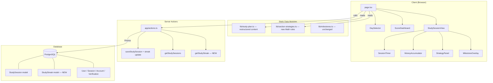

# Design Document: Optimized Study Plan

## Overview

This feature restructures the existing 41-day ACT prep study plan and supporting data to address gaps identified through user research: no Desmos calculator training, no anti-anxiety scaffolding for math, test strategies buried in tips rather than practiced as dedicated days, an overly broad math scope for shaky foundations, no streak tracking for accountability, and no early diagnostic checkpoint.

The changes span six areas:

1. **Study plan content** (`lib/study-plan.ts`) — Restructured day-by-day topics within the same 41-day / 4-phase skeleton. Math days narrow to pre-algebra and algebra repetition in Phase 1, geometry compresses to one day, trig defers to Phase 2. Two Desmos training days and two test-strategy days are added. The Reading maintenance passage moves earlier to make room for a diagnostic checkpoint on Day 16.
2. **Section strategies** (`lib/section-strategies.ts`) — New Math rules for anti-anxiety scaffolding, Desmos usage, and backsolving/picking-numbers. Updated overview, tips, and resources.
3. **Streak persistence** (`prisma/schema.prisma`) — New `StudyStreak` model storing current streak count and last session date per user.
4. **Server actions** (`app/actions.ts`) — `saveStudySession` extended to calculate and upsert streak. New `getStudyStreak` action.
5. **Dashboard display** (`components/score-dashboard.tsx`) — Streak card added to the existing dashboard layout.
6. **Page wiring** (`app/page.tsx`) — Fetches streak data on load, passes it to `ScoreDashboard`, updates streak after session completion.

### Key Design Decisions

1. **Content-only plan changes, same structure**: The `StudyPlanDay` interface is unchanged. All 41 entries keep the same `dayNumber`, `date`, `isoDate`, `phase`, and `phaseName` values. Only `section`, `topic`, `resource`, and `timeMinutes` change on affected days. This means `DaySelector`, `StudySessionView`, and all other components that consume `StudyPlanDay` require zero interface changes.
2. **Streak as a separate model, not derived**: Rather than computing streak from the `StudySession` table on every load (which requires scanning all sessions and sorting by date), we store a denormalized `StudyStreak` record that's updated atomically during `saveStudySession`. This keeps reads O(1) and writes O(1).
3. **Streak calculation in the server action**: The streak logic (yesterday → increment, today → no-op, otherwise → reset to 1) runs inside `saveStudySession` in a single transaction with the session upsert. No separate cron job or client-side calculation needed.
4. **Anti-anxiety scaffolding as content, not code**: The "5 confidence-builder warm-up problems" guidance lives in the `topic` string of each Math day and in a new strategy rule. No new UI component is needed — the existing `StrategyPanel` renders it.
5. **Desmos and test-strategy days use existing section types**: Desmos training days use `section: "Math"`. Test-strategy days use `section: "Math"`. No new section type needed.

## Architecture

The architecture is unchanged from the existing app. The only additions are the `StudyStreak` model and the streak-related server action. The component tree gains a streak prop on `ScoreDashboard` but no new components.



### Data Flow Changes

1. **Page load**: `page.tsx` now calls both `getStudySessions()` and `getStudyStreak()` in parallel. Streak data is passed to `ScoreDashboard`.
2. **Session completion**: `saveStudySession()` now returns `{ ok: true, streak: number }`. The page updates the streak display optimistically from the response.
3. **All other flows are unchanged.**

## Components and Interfaces

### Modified: `lib/study-plan.ts`

The `StudyPlanDay` interface is **unchanged**. The `STUDY_PLAN` array content is restructured as follows:

#### Phase 0 (Day 1) — Unchanged
| Day | Section | Topic |
|-----|---------|-------|
| 1 | Setup | Register for June 13 ACT, verify FMS requirement, set up study resources |

#### Phase 1 (Days 2–16) — Restructured

Key changes from current plan:
- **Day 8**: Was "Run-on sentences, fragments, semicolons" → Now **Reading maintenance passage** (moved from Day 16)
- **Day 9**: Was "Inequalities + absolute value basics" → Now **Desmos basics** (graphing equations, finding intersections)
- **Day 11**: Was "Exponent rules + order of operations" → Now **Backsolving & picking-numbers techniques** (test strategy day)
- **Day 13**: Was "Geometry: area, perimeter, angles, triangles" → Now **Geometry formulas only** (area, perimeter, circumference, Pythagorean theorem — single compressed day)
- **Day 15**: Was "Coordinate geometry: slope, y-intercept, graphing lines" → Now **Exponent rules + order of operations** (moved from Day 11 slot)
- **Day 16**: Was "Reading maintenance passage" → Now **Diagnostic checkpoint** (10 questions: ~3 English, ~4 Math, ~3 Reading)
- English run-ons/fragments content moves to Day 10 (combined with pronoun errors day)
- All Math days include "Start with 5 confidence-builder warm-ups" in topic text

| Day | Date | Section | Topic (new) | Resource | Time |
|-----|------|---------|-------------|----------|------|
| 2 | May 4 | English | Comma rules — the single most tested grammar concept | Khan Academy Grammar → Commas | 60 |
| 3 | May 5 | Math | Fractions, decimals, percentages — Start with 5 confidence-builder warm-ups, then foundational practice | Khan Academy Pre-Algebra | 60 |
| 4 | May 6 | English | Apostrophes & possessives (it's vs its, plural vs possessive) | Khan Academy → Apostrophes | 60 |
| 5 | May 7 | Math | Ratios, proportions, rates — Start with 5 confidence-builder warm-ups, then high-frequency practice | Khan Academy → Ratios | 60 |
| 6 | May 8 | English | Subject-verb agreement (tricky when prepositional phrases separate them) | section-strategies.md | 60 |
| 7 | May 9 | Math | Solving linear equations — Start with 5 confidence-builder warm-ups, then one-variable, two-step, word problems | Khan Academy → Algebra Basics | 60 |
| 8 | May 10 | Reading | Maintenance: 1 full timed passage (9 questions, 10 min) + review | Old prep book or free online | 60 |
| 9 | May 11 | Math | Desmos basics — Start with 5 confidence-builder warm-ups, then learn to graph equations, find intersections, use sliders | Acely ACT Desmos Guide, desmos.com/calculator | 60 |
| 10 | May 12 | English | Run-on sentences, fragments, semicolons + pronoun errors | Khan Academy → Sentence Structure, section-strategies.md | 60 |
| 11 | May 13 | Math | Backsolving & picking numbers — Start with 5 confidence-builder warm-ups, then learn to plug in answer choices and substitute simple values | section-strategies.md | 60 |
| 12 | May 14 | English | Parallelism + comparisons + wordiness & redundancy | section-strategies.md | 60 |
| 13 | May 15 | Math | Geometry formulas only — Start with 5 confidence-builder warm-ups, then area, perimeter, circumference, Pythagorean theorem | Khan Academy → Basic Geometry | 60 |
| 14 | May 16 | English | Modifier placement + rhetorical skills intro (transitions) | section-strategies.md | 60 |
| 15 | May 17 | Math | Exponent rules + order of operations — Start with 5 confidence-builder warm-ups | Khan Academy → Exponents | 60 |
| 16 | May 18 | All | Diagnostic checkpoint: 10-question mini-assessment (~3 English, ~4 Math, ~3 Reading) — measure progress before Phase 2 | Free Enhanced ACT practice | 45 |

**What changed and why:**
- Reading maintenance moved from Day 16 → Day 8 to free Day 16 for the diagnostic checkpoint. Day 8 was previously English (run-ons/fragments), which is consolidated into Day 10 with pronoun errors — both are sentence-level grammar topics that pair naturally.
- Day 14 now covers modifier placement + rhetorical skills intro (previously wordiness was Day 14, now consolidated into Day 12 with parallelism). This gives English coverage of all 8 grammar rules plus rhetorical intro within Phase 1.
- Desmos basics on Day 9 replaces inequalities/absolute value (deferred to Phase 2 where it pairs with timed practice).
- Backsolving/picking-numbers on Day 11 replaces exponent rules (moved to Day 15). Test strategies are high-ROI and don't require new math knowledge.
- Geometry compressed to formulas-only on Day 13 (was area + perimeter + angles + triangles). Coordinate geometry deferred to Phase 2.
- No trigonometry in Phase 1 at all.

#### Phase 2 (Days 17–30) — Restructured

| Day | Date | Section | Topic (new) | Resource | Time |
|-----|------|---------|-------------|----------|------|
| 17 | May 19 | English | Rhetorical skills focus: transitions, add/delete, sentence ordering | section-strategies.md | 45 |
| 18 | May 20 | Math | Inequalities + coordinate geometry (slope, midpoint, distance) — Start with 5 warm-ups | Khan Academy → Inequalities, Coordinate Plane | 45 |
| 19 | May 21 | English | Full timed English section (50 Qs, 35 min) + error review | Free Enhanced ACT practice | 45 |
| 20 | May 22 | Math | Systems of equations + quadratics (FOIL, factoring) — Start with 5 warm-ups | Khan Academy → Systems of equations, Quadratics | 45 |
| 21 | May 23 | English | Timed drill: 25 grammar-only questions in 15 min | Free Enhanced ACT practice | 45 |
| 22 | May 24 | Math | Statistics: mean, median, mode, probability — Start with 5 warm-ups | Khan Academy → Statistics | 45 |
| 23 | May 25 | Math | Desmos ACT practice — Start with 5 warm-ups, then apply Desmos to ACT-style problems under timed conditions | Acely ACT Desmos Guide, desmos.com/calculator | 45 |
| 24 | May 26 | English | Weakest English topics — targeted re-drill based on errors | Khan Academy + section-strategies.md | 45 |
| 25 | May 27 | Math | Backsolving & picking numbers timed practice — 15 ACT-style problems in 20 min | Free Enhanced ACT practice, section-strategies.md | 45 |
| 26 | May 28 | English | Full timed English section #2 + error review | Free Enhanced ACT practice | 45 |
| 27 | May 29 | Math | Trig basics: SOH-CAH-TOA (just the fundamentals, 2–3 test questions) | Khan Academy → Trigonometry | 45 |
| 28 | May 30 | Math | Full timed Math section (45 Qs, 50 min) + error review | Free Enhanced ACT practice | 45 |
| 29 | May 31 | Reading | Timed passage practice — focus on inference + vocab-in-context | Free Enhanced ACT practice | 45 |
| 30 | Jun 1 | All | Mini-test: 15 English + 15 Math + 9 Reading (timed) — checkpoint | Free Enhanced ACT practice | 45 |

**What changed and why:**
- Day 18: Inequalities (deferred from Phase 1) combined with coordinate geometry. Both are algebra-adjacent and pair well.
- Day 23: Was Reading full section → Now Desmos ACT practice (second Desmos day). Reading full section moves to Day 29 area (Reading already has Day 29 for timed passage practice, and the full section practice happens in Phase 3's full practice test on Day 31).
- Day 25: Was Pythagorean theorem + special right triangles + circles → Now backsolving/picking-numbers timed practice (second test-strategy day). Pythagorean theorem is covered in Day 13's geometry formulas day. Special right triangles and circle formulas are Tier 2 content already covered in the geometry formulas day.
- Day 27: Trig basics stays — this is the single trig day, now explicitly in Phase 2 as required.
- Day 28: Was "Full timed Math section #2" → Now just "Full timed Math section" (renumbered since the first full math section was removed to make room for Desmos/test-strategy days).

#### Phase 3 (Days 31–41) — Unchanged

Phase 3 content remains identical. No restructuring needed — it's already focused on full practice tests and final sharpening.

| Day | Date | Section | Topic | Time |
|-----|------|---------|-------|------|
| 31 | Jun 2 | All | Full Practice Test (all 3 sections, timed, test conditions) | 150 |
| 32 | Jun 3 | All | Deep review of every wrong answer on the practice test | 45 |
| 33 | Jun 4 | All | Targeted drill: weakest section from practice test | 30 |
| 34 | Jun 5 | All | Targeted drill: 2nd weakest section + register for July 11 ACT | 30 |
| 35 | Jun 6 | English | English: rapid-fire grammar drill — 25 questions, 15 min | 20 |
| 36 | Jun 7 | Math | Math: first-30-questions drill — accuracy on easy/medium | 30 |
| 37 | Jun 8 | Reading | Reading: 1 passage, focus on speed + evidence | 15 |
| 38 | Jun 9 | All | Review error patterns — what keeps coming up? Hit those. | 20 |
| 39 | Jun 10 | All | Light confidence builder — 10 easy questions per section | 15 |
| 40 | Jun 11 | Rest | REST. No studying. Prepare test-day supplies. | 0 |
| 41 | Jun 12 | Rest | REST. Early bed. Alarm set. | 0 |

### Modified: `lib/section-strategies.ts`

The `SectionStrategy` and `StrategyRule` interfaces are **unchanged**. The Math section strategy is updated:

#### Math Section Changes

**Overview** (updated):
```
"ACT Math goes from easy to hard. Questions 1–20 are straightforward, 21–35 are medium, 36–45 are hard. A score of 24 lives almost entirely in the first 30 questions. Going from 18 to 24 means getting about 7–9 more right answers. She does NOT need to master the hard stuff. Trigonometry is deprioritized — guess the 2–3 trig questions and focus time on pre-algebra, algebra, and test strategies (backsolving, picking numbers, Desmos)."
```

**Rules array** (3 new rules prepended, existing rules retained):

New rule 1 (index 0):
```typescript
{
  title: "Anti-Anxiety Scaffolding",
  content: "Every math session starts with 5 confidence-builder problems — easy wins from topics you already know. This isn't wasted time; it's warm-up that gets your brain in math mode and proves you CAN do this. Confusion on harder problems is normal and expected. If you hit a wall, switch to untimed practice. Speed comes after accuracy. You're not bad at math — you're building math muscles.",
}
```

New rule 2 (index 1):
```typescript
{
  title: "Desmos Graphing Calculator",
  content: "The Enhanced ACT 2026 has a built-in Desmos calculator. Learn to use it — it can solve problems visually that are hard to solve algebraically. Graph both sides of an equation and find the intersection. Plug in answer choices by graphing y = (expression) and checking which x-value matches. Use sliders to test different values. For systems of equations, graph both lines and read the intersection point.",
  examples: [
    "Solve 2x + 3 = 11: Graph y = 2x + 3 and y = 11, find intersection at x = 4",
    "Which value of x satisfies x² - 5x + 6 = 0? Graph y = x² - 5x + 6, find where it crosses y = 0",
    "Systems: Graph y = 2x + 1 and y = -x + 7, intersection is the solution",
  ],
}
```

New rule 3 (index 2):
```typescript
{
  title: "Backsolving & Picking Numbers",
  content: "Two test strategies that earn points without learning new math. Backsolving: plug each answer choice back into the problem. Start with choice B or C (middle values). If the result is too big, try A; too small, try D. Picking numbers: when answer choices have variables, substitute simple values (x = 2, x = 3) into the problem, solve, then check which answer choice gives the same result. These techniques work on 30–40% of ACT math questions.",
  examples: [
    "Backsolving: 'If 3x - 7 = 14, what is x?' Try B (x=7): 3(7)-7 = 14 ✓",
    "Picking numbers: 'Which equals 2(x+3)?' Let x=2: 2(2+3) = 10. Check choices for 10.",
    "Picking numbers: 'If a shirt costs d dollars after 20% off, original price?' Let d=80: original = 80/0.8 = 100. Check choices.",
  ],
}
```

All existing Tier 1, Tier 2, and Tier 3 rules are retained at their current positions (shifted by 3 indices).

**Tips array** (2 new tips added):
```typescript
// Add to existing tips array:
"Use the Desmos graphing calculator to check answers visually — graph both sides and find the intersection.",
"Start each session with 5 confidence-builder problems to warm up and manage anxiety.",
```

**Resources array** (2 new entries added):
```typescript
// Add to existing resources array:
{ name: "Acely ACT Desmos Guide", url: "https://www.acely.com/blog/how-to-use-desmos-on-the-act" },
{ name: "Desmos Graphing Calculator", url: "https://www.desmos.com/calculator" },
```

### New: `StudyStreak` Prisma Model

```prisma
model StudyStreak {
  id              Int       @id @default(autoincrement())
  userId          String    @unique
  currentStreak   Int       @default(0)
  lastSessionDate DateTime?
  createdAt       DateTime  @default(now())
  updatedAt       DateTime  @updatedAt
  user            User      @relation(fields: [userId], references: [id], onDelete: Cascade)

  @@map("study_streak")
}
```

The `User` model gains a `studyStreak StudyStreak?` relation field.

### Modified: `app/actions.ts`

#### `saveStudySession` — Updated Return Type and Streak Logic

```typescript
export async function saveStudySession(data: {
  dayNumber: number;
  section: string;
  topic: string;
  elapsedSeconds: number;
  notes?: string;
}): Promise<{ ok: true; streak: number }> {
  const session = await auth.api.getSession({ headers: await headers() });
  if (!session) throw new Error("Unauthorized");

  const { dayNumber, section, topic, elapsedSeconds, notes } = data;
  if (!Number.isInteger(dayNumber) || dayNumber < 1 || dayNumber > 41) {
    throw new Error("Invalid day number");
  }

  // Upsert study session (existing logic)
  await prisma.studySession.upsert({
    where: { dayNumber_userId: { dayNumber, userId: session.user.id } },
    create: {
      dayNumber, section, topic, elapsedSeconds,
      notes: notes ?? null, endTime: new Date(), userId: session.user.id,
    },
    update: { endTime: new Date(), elapsedSeconds, notes: notes ?? null },
  });

  // Calculate and upsert streak
  const today = new Date();
  const todayDate = new Date(today.getFullYear(), today.getMonth(), today.getDate());

  const existing = await prisma.studyStreak.findUnique({
    where: { userId: session.user.id },
  });

  let newStreak: number;

  if (!existing || !existing.lastSessionDate) {
    // No prior streak record — start at 1
    newStreak = 1;
  } else {
    const lastDate = new Date(
      existing.lastSessionDate.getFullYear(),
      existing.lastSessionDate.getMonth(),
      existing.lastSessionDate.getDate(),
    );
    const diffDays = Math.round(
      (todayDate.getTime() - lastDate.getTime()) / (1000 * 60 * 60 * 24),
    );

    if (diffDays === 0) {
      // Already logged today — streak unchanged
      newStreak = existing.currentStreak;
    } else if (diffDays === 1) {
      // Consecutive day — increment
      newStreak = existing.currentStreak + 1;
    } else {
      // Gap — reset to 1
      newStreak = 1;
    }
  }

  await prisma.studyStreak.upsert({
    where: { userId: session.user.id },
    create: {
      userId: session.user.id,
      currentStreak: newStreak,
      lastSessionDate: todayDate,
    },
    update: {
      currentStreak: newStreak,
      lastSessionDate: todayDate,
    },
  });

  return { ok: true, streak: newStreak };
}
```

#### `getStudyStreak` — New Action

```typescript
export interface StudyStreakRecord {
  currentStreak: number;
  lastSessionDate: Date | null;
}

export async function getStudyStreak(): Promise<StudyStreakRecord> {
  const session = await auth.api.getSession({ headers: await headers() });
  if (!session) return { currentStreak: 0, lastSessionDate: null };

  const record = await prisma.studyStreak.findUnique({
    where: { userId: session.user.id },
    select: { currentStreak: true, lastSessionDate: true },
  });

  if (!record) return { currentStreak: 0, lastSessionDate: null };
  return record;
}
```

### Modified: `components/score-dashboard.tsx`

**Props change:**

```typescript
interface ScoreDashboardProps {
  completedDays: number;
  currentMilestone: OwlMilestone | undefined;
  nextMilestone: OwlMilestone | undefined;
  streakCount: number;  // NEW
}
```

**New streak card** added to the dashboard layout (between the Scores card and the Scholarship Goal card):

```tsx
<Card size="sm">
  <CardHeader>
    <CardTitle className="flex items-center gap-2 text-sm">
      <Flame className="w-4 h-4 text-orange-500" />
      Study Streak
    </CardTitle>
  </CardHeader>
  <CardContent>
    {streakCount > 0 ? (
      <p className="text-lg font-bold tabular-nums">
        {streakCount} day{streakCount !== 1 ? "s" : ""} streak 🔥
      </p>
    ) : (
      <p className="text-sm text-muted-foreground">Start your streak!</p>
    )}
  </CardContent>
</Card>
```

The `Flame` icon is imported from `lucide-react`.

### Modified: `app/page.tsx`

**Changes:**
1. Import `getStudyStreak` and `StudyStreakRecord` from `@/app/actions`
2. Add `streakCount` state: `const [streakCount, setStreakCount] = useState(0)`
3. In the session-fetch `useEffect`, call `getStudyStreak()` in parallel and set state
4. Pass `streakCount` to `ScoreDashboard`
5. In `handleSessionComplete`, update streak from the save response:

```typescript
const handleSessionComplete = useCallback(async (result: StudySessionRecord & { streak?: number }) => {
  // ... existing milestone logic ...
  if (result.streak !== undefined) {
    setStreakCount(result.streak);
  }
}, [completedSessions]);
```

Note: The `StudySessionView` component's `onComplete` callback will need to pass the streak value from the `saveStudySession` response. The `StudySessionView` already calls `saveStudySession` and constructs a result object — it will include the `streak` field from the response.

## Data Models

### Existing Models — Unchanged

- `User`, `Session`, `Account`, `Verification` — better-auth models, no changes
- `StudySession` — no schema changes

### New Model: `StudyStreak`

```prisma
model StudyStreak {
  id              Int       @id @default(autoincrement())
  userId          String    @unique
  currentStreak   Int       @default(0)
  lastSessionDate DateTime?
  createdAt       DateTime  @default(now())
  updatedAt       DateTime  @updatedAt
  user            User      @relation(fields: [userId], references: [id], onDelete: Cascade)

  @@map("study_streak")
}
```

**User model addition:**
```prisma
model User {
  // ... existing fields ...
  studySessions StudySession[]
  studyStreak   StudyStreak?    // NEW — one-to-one relation
}
```

### TypeScript Types

```typescript
// New — returned by getStudyStreak
export interface StudyStreakRecord {
  currentStreak: number;
  lastSessionDate: Date | null;
}

// Modified — saveStudySession now returns streak
// Old: Promise<{ ok: true }>
// New: Promise<{ ok: true; streak: number }>
```

### Streak Calculation Logic (Pure Function)

The streak calculation can be extracted as a pure function for testability:

```typescript
export function calculateStreak(
  existingStreak: number,
  lastSessionDate: Date | null,
  today: Date,
): number {
  if (!lastSessionDate) return 1;

  const todayDate = new Date(today.getFullYear(), today.getMonth(), today.getDate());
  const lastDate = new Date(
    lastSessionDate.getFullYear(),
    lastSessionDate.getMonth(),
    lastSessionDate.getDate(),
  );
  const diffDays = Math.round(
    (todayDate.getTime() - lastDate.getTime()) / (1000 * 60 * 60 * 24),
  );

  if (diffDays === 0) return existingStreak;
  if (diffDays === 1) return existingStreak + 1;
  return 1;
}
```


## Correctness Properties

*A property is a characteristic or behavior that should hold true across all valid executions of a system — essentially, a formal statement about what the system should do. Properties serve as the bridge between human-readable specifications and machine-verifiable correctness guarantees.*

### Property 1: Study plan structural validity with phase mapping

*For any* entry in the STUDY_PLAN array, the entry SHALL have a dayNumber between 1 and 41 (inclusive), a valid isoDate matching YYYY-MM-DD format, a phase between 0 and 3, a section that is one of "English" | "Math" | "Reading" | "All" | "Setup" | "Rest", a non-empty topic, a non-empty resource, and a non-negative timeMinutes. The array SHALL contain exactly 41 entries with unique dayNumbers. Additionally, *for any* entry, the phase SHALL match the day range: Day 1 → Phase 0, Days 2–16 → Phase 1, Days 17–30 → Phase 2, Days 31–41 → Phase 3.

**Validates: Requirements 1.5**

### Property 2: Math days include confidence-builder guidance

*For any* entry in the STUDY_PLAN array where section is "Math", the topic string SHALL contain text indicating the session starts with confidence-builder warm-up problems (e.g., containing "confidence-builder" or "warm-up").

**Validates: Requirements 3.1**

### Property 3: Streak calculation correctness

*For any* non-negative integer `existingStreak`, any `lastSessionDate` (or null), and any `today` date where `today >= lastSessionDate`, the `calculateStreak` function SHALL return:
- `1` when `lastSessionDate` is null (no prior sessions)
- `existingStreak` when `lastSessionDate` is the same calendar day as `today` (already logged today)
- `existingStreak + 1` when `lastSessionDate` is exactly 1 calendar day before `today` (consecutive day)
- `1` when `lastSessionDate` is more than 1 calendar day before `today` (streak broken)

**Validates: Requirements 6.2**

## Error Handling

### Server Action Errors

| Error Scenario | Handling |
|---|---|
| Unauthenticated `saveStudySession` call | Throw `Error("Unauthorized")` — unchanged from existing behavior |
| Unauthenticated `getStudyStreak` call | Return `{ currentStreak: 0, lastSessionDate: null }` — graceful degradation, same pattern as `getStudySessions` |
| Invalid dayNumber (outside 1–41) | Validate on server, throw `Error("Invalid day number")` — unchanged |
| Database connection failure during streak upsert | Prisma throws; server action propagates error; client shows "Save failed" with retry. The study session upsert and streak upsert are separate operations — if the session saves but streak fails, the session is still persisted. On next save, the streak will self-correct. |
| Streak record race condition | The `userId` unique constraint + Prisma upsert handles concurrent writes atomically. No application-level handling needed. |
| `lastSessionDate` in the future (clock skew) | The `calculateStreak` function treats any `diffDays <= 0` as "same day" (streak unchanged). This handles minor clock skew gracefully. |

### Client-Side Errors

| Error Scenario | Handling |
|---|---|
| `getStudyStreak` fails on page load | Default to `streakCount: 0`. The streak display shows "Start your streak!" which is a safe fallback. |
| `saveStudySession` returns without streak field | Treat as `streak: undefined`, don't update the streak display. It will correct on next page load. |
| Streak display shows stale data | On session completion, the streak is updated from the server response. On page load, it's fetched fresh. No long-lived stale state. |

## Testing Strategy

### Unit Tests (Example-Based)

Unit tests verify specific structural assertions on static data and UI rendering:

**Study plan content assertions:**
- STUDY_PLAN has at least 3 Phase 1 pre-algebra math days (Req 1.1)
- STUDY_PLAN has at least 3 Phase 1 algebra math days (Req 1.2)
- STUDY_PLAN has exactly 1 Phase 1 geometry day (Req 1.3)
- No Phase 1 day mentions trigonometry; exactly 1 Phase 2 day does (Req 1.4)
- Phase 1 maintains English/Math alternation with one Reading day (Req 1.6)
- At least 2 Desmos training days exist (1 in Phase 1, 1 in Phase 2) (Req 2.1)
- Desmos days reference Acely guide or desmos.com in resource field (Req 2.2)
- At least 2 test-strategy days exist (1 in Phase 1, 1 in Phase 2) (Req 4.1–4.3)
- Day 16 is section "All" with diagnostic checkpoint topic (Req 5.1–5.2)
- A Reading day exists in Phase 1 before Day 16 (Req 5.3)

**Section strategy content assertions:**
- Math section has "Desmos" rule with examples (Req 2.3)
- Math section has Desmos resource with URL (Req 2.4)
- Math section has "Anti-Anxiety Scaffolding" rule at index 0 (Req 3.2–3.3)
- Math section has "Backsolving" rule with examples (Req 4.4)
- Math overview mentions trig deprioritized (Req 8.1)
- Math tips include Desmos and confidence-builder tips (Req 8.2–8.3)
- Math resources include Acely and Desmos URLs (Req 8.4)
- All original Tier 1/Tier 2 rule titles still present (Req 8.5)

**Streak UI assertions:**
- ScoreDashboard renders streak count with "day streak" label when count > 0 (Req 7.1)
- ScoreDashboard renders "Start your streak!" when count is 0 (Req 7.2)
- ScoreDashboard renders streak card in layout (Req 7.3)

**Edge cases:**
- `getStudyStreak` returns `{ currentStreak: 0, lastSessionDate: null }` for user with no streak record (Req 6.5)
- `calculateStreak` with `lastSessionDate: null` returns 1

### Property-Based Tests

Property-based tests use [fast-check](https://github.com/dubzzz/fast-check) to verify universal properties across generated inputs. Each test runs a minimum of 100 iterations.

| Property | Test Description | Tag |
|---|---|---|
| Property 1 | Generate index into STUDY_PLAN, verify all fields valid and phase matches day range | `Feature: optimized-study-plan, Property 1: Study plan structural validity with phase mapping` |
| Property 2 | Generate index into STUDY_PLAN, filter to Math days, verify topic contains confidence-builder text | `Feature: optimized-study-plan, Property 2: Math days include confidence-builder guidance` |
| Property 3 | Generate (existingStreak: nat, lastSessionDate: Date or null, today: Date), verify calculateStreak output matches the streak rules | `Feature: optimized-study-plan, Property 3: Streak calculation correctness` |

**Property test configuration:**
- Library: fast-check
- Minimum iterations: 100 per property
- Each test tagged with a comment: `Feature: optimized-study-plan, Property {number}: {title}`
- Each correctness property implemented as a single property-based test

### Integration Tests

- **Streak round-trip**: Save a session via `saveStudySession`, call `getStudyStreak`, verify streak count matches expected value
- **Streak increment**: Save sessions on consecutive days, verify streak increments correctly
- **Streak reset**: Save a session, skip a day, save again, verify streak resets to 1
- **Streak idempotency**: Save two sessions on the same day, verify streak count doesn't double-increment
- **Cascade delete**: Create user with streak record, delete user, verify streak record is gone
- **saveStudySession returns streak**: Verify the response object includes `{ ok: true, streak: number }`
